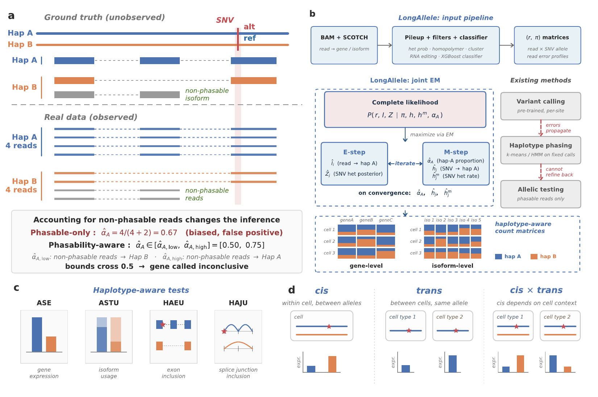

# LongAllele

**Haplotype-resolved allele-specific expression and transcript usage from long-read RNA sequencing.**

LongAllele is a statistical framework for haplotype-resolved allelic analysis for long-read RNA sequencing data, supporting both bulk and single-cell level. From aligned BAM files, it jointly infers heterozygous variants and read-haplotype alignments through an expectation–maximization (EM) algorithm, and quantifies allele-specific expression (ASE), allele-specific transcript usage (ASTU), and local haplotype-associated exon and junction events (HAEU / HAJU).

<p align="center">
  
</p>
<p align="center"><em>LongAllele framework. <b>(a, b)</b> Phasability-aware joint EM inference of heterozygous SNVs and read-haplotype assignments. <b>(c)</b> Four allelic test layers: ASE, ASTU, HAEU, HAJU. <b>(d)</b> Within-individual <i>cis</i>-regulatory dissection.</em></p>

## Installation

```bash
git clone https://github.com/Karenxzr/sc_ase.git
cd sc_ase
# Recommended: a fresh Python 3.9+ environment (conda or venv)
pip install -r requirements.txt
```

**Upstream dependency:** [SCOTCH](https://github.com/WGLab/SCOTCH) — required to produce the `scotch_target` directory consumed by LongAllele.

Tested on Python 3.9+ / Linux. A pinned `environment.yml` will be added in an upcoming release.

## Pipeline overview

LongAllele runs as a five-step pipeline on top of [SCOTCH](https://github.com/WGLab/SCOTCH) read-to-isoform mappings. Steps 1–3 are typically launched as SLURM job arrays for parallelism across genes; steps 4–5 are single jobs.

```
BAM + FASTA
    ↓
SCOTCH  ──────────────────────────────────────────────┐
    ↓ (read→gene/isoform mappings)                    │
Step 1: Variant calling (initial SNV candidates)      │
    ↓                                                  │
Step 2: EM input generation (per-gene read×SNV tables)│
    ↓                                                  │
Step 3: EM haplotyping (read→haplotype assignments)   │
    ↓                                                  │
Step 4: Summary statistics + count matrices           │
    ↓                                                  │
Step 5: Downstream analysis ◄─────────────────────────┘
        (effect sizes, SNV–event linkage)
```

## Pipeline

All steps are invoked via `src/longallele.py --task <stepN>`.

### Inputs

| Path | Provided by | Used in steps |
|------|-------------|---------------|
| `--scotch_target` directory | [SCOTCH](https://github.com/WGLab/SCOTCH) preprocessing | All steps |
| `--bam_path` aligned BAM file(s) | User alignment | Steps 1, 2, 5 |
| `--ref_fasta_path` reference FASTA | User | Steps 1–3 |
| `--cell_type_df_path` cell-type CSV (`Cell`, `CellType`) | User (optional) | Steps 3–5 |

Within `--scotch_target`, LongAllele reads two files:

- `reference/geneStructureInformationupdated.pkl` — gene / isoform structure (fallbacks: `metageneStructureInformationwnovel.pkl`, `geneStructureInformation.pkl`, `metageneStructureInformation.pkl`)
- `auxillary/all_read_isoform_exon_mapping.tsv` — per-read gene / isoform assignments; only rows with `Keep==1` are used

### Step 1 — Variant calling

```bash
#!/bin/bash
#SBATCH --job-name=la_step1
#SBATCH --array=0-49          # job array: 1 CPU per task, 50 tasks
#SBATCH --cpus-per-task=1
#SBATCH --mem=8G
#SBATCH --output=logs/step1_%a.out

python src/longallele.py --task step1 \
    --scotch_target /path/to/scotch \
    --bam_path /path/to/sample.bam \
    --ref_fasta_path /path/to/genome.fa \
    --output_folder /results \
    --n_jobs 50 --job_index $SLURM_ARRAY_TASK_ID
```

### Step 2 — EM input generation

```bash
#!/bin/bash
#SBATCH --job-name=la_step2
#SBATCH --array=0-49          # job array: 1 CPU per task, 50 tasks
#SBATCH --cpus-per-task=1
#SBATCH --mem=8G
#SBATCH --output=logs/step2_%a.out

python src/longallele.py --task step2 \
    --scotch_target /path/to/scotch \
    --bam_path /path/to/sample.bam \
    --ref_fasta_path /path/to/genome.fa \
    --output_folder /results \
    --n_jobs 50 --job_index $SLURM_ARRAY_TASK_ID
```

### Step 3 — Haplotyping (EM)

```bash
#!/bin/bash
#SBATCH --job-name=la_step3
#SBATCH --array=0-49          # job array: 1 CPU per task, 50 tasks
#SBATCH --cpus-per-task=1
#SBATCH --mem=16G             # increase if OOM-killed
#SBATCH --output=logs/step3_%a.out

python src/longallele.py --task step3 \
    --scotch_target /path/to/scotch \
    --output_folder /results \
    --n_jobs 50 --job_index $SLURM_ARRAY_TASK_ID \
    --seed 42 --max_iter 50 --tol 1e-3 \
    --rna_editing_db src/rna_editing_hg38.npz

# Verify after all tasks finish:
# ls /results/job_markers/step3_*.done | wc -l   # should equal 50
```

### Step 4 — Summary statistics and count matrix

```bash
#!/bin/bash
#SBATCH --job-name=la_step4
#SBATCH --cpus-per-task=1     # single job, no array
#SBATCH --mem=16G
#SBATCH --output=logs/step4.out

python src/longallele.py --task step4 \
    --scotch_target /path/to/scotch \
    --output_folder /results \
    --summary_haplotype --summary_count
```

### Step 5 — Downstream analysis

```bash
#!/bin/bash
#SBATCH --job-name=la_step5
#SBATCH --cpus-per-task=16    # single job, multiple CPUs — set --n_workers to match
#SBATCH --mem=32G
#SBATCH --output=logs/step5.out

python src/longallele.py --task step5 \
    --scotch_target /path/to/scotch \
    --output_folder /results \
    --bam_path /path/to/sample.bam \
    --event_min_reads 10 \
    --snv_event_distance 50 \
    --n_workers 16 \
    --astu_sig_only --astu_sig_threshold 0.05
```

### Job completion markers

Markers are written to `{output_folder}/job_markers/` so that array runs can be verified before launching downstream steps:

| File | Written when |
|------|-------------|
| `step1_job{N}.done` | Step 1 job N completed successfully |
| `step2_job{N}.done` | Step 2 job N completed successfully |
| `step3_job{N}.done` | Step 3 job N completed successfully |
| `step4.done` | Step 4 completed successfully |
| `step5.done` | Step 5 completed successfully |

## Common workflows

### Multi-sample analysis

Pass multiple SCOTCH directories and BAM files together:

```bash
python src/longallele.py --task step1 \
    --scotch_target /scotch/sample1 /scotch/sample2 \
    --bam_path sample1.bam sample2.bam \
    --sample_names sample1 sample2 \
    --output_folder /results \
    --n_jobs 10 --job_index 0
```

### Cell-type-specific analysis

Provide a CSV with `Cell` and `CellType` columns to get per-cell-type haplotype assignments, isoform tables, and downstream statistics:

```bash
python src/longallele.py --task step3 \
    ... \
    --cell_type_df_path cell_types.csv
```

Step 5 will automatically detect available cell types from the summary statistics and run all downstream analyses per cell type in addition to bulk.

### Haplotype-split BAM utility

Generate per-sample, per-cell-type, per-haplotype BAM files for a single gene (useful for sashimi plots and IGV visualization):

```bash
python src/generate_gene_hap_bam.py \
    --gene_name CLU \
    --scotch_target /path/to/scotch \
    --bam_path /path/to/aligned.bam \
    --longallele_path /path/to/longallele/output \
    --celltype_csv /path/to/celltype.csv \
    --output_dir /output/CLU_bam \
    --sample_id sample1 \
    --prefix snvfilter
```

Outputs `{gene}_{sample}_{celltype}_{hapA/hapB}.bam` files sorted and indexed. The `--prefix` argument should match the prefix used during Step 3 haplotyping (omit if no prefix was used).

## Configuration

### Key parameters

| Parameter | Description | Default |
|-----------|-------------|---------|
| `--scotch_target` | Path(s) to SCOTCH output directory | required |
| `--bam_path` | Input BAM file(s) | required for steps 1–2 |
| `--ref_fasta_path` | Reference genome FASTA | required for steps 1–3 |
| `--output_folder` | Output directory | required |
| `--n_jobs` | Total number of parallel jobs | 1 |
| `--job_index` | This job's index (0-based) | 0 |
| `--prefix` | Prefix for output file names | none |
| `--seed` | Random seed for EM | 42 |
| `--depth` | Minimum read depth for SNV calling | 5 |
| `--n_alt_count` | Minimum alt-allele count | 1 |
| `--heterozygous_filter` | Heterozygosity probability threshold | 0.99 |
| `--het_fallback` | Enable stepped fallback for het filter (see below) | off |
| `--cell_type_df_path` | CSV(s) with `Cell` and `CellType` columns for per-cell-type analysis | none |
| `--gene_subset_path` | Plain-text file (one gene ID per line) to restrict analysis to a subset of genes | none |
| `--snv_confidence_path` | Pre-defined high-confidence SNV set (TSV); skips all noise filters when provided | none |
| `--rna_editing_db` | Compact RNA editing database (`.npz`) for filtering known A-to-I editing sites | `src/rna_editing_hg38.npz` |
| `--repeat_filter_kmer` | Max k-mer size for repeat filtering (0=off, 1=homopolymer, 2=+dinuc, 3=+trinuc) | 1 |

### SNV noise filtering

Before EM haplotyping, LongAllele applies several filters to remove candidate SNVs that are likely noise rather than true heterozygous variants. These filters are skipped when `--snv_confidence_path` is provided (user supplies pre-called confident SNVs).

| Filter | What it removes | Key parameter |
|--------|----------------|---------------|
| Heterozygous probability | Homozygous sites (binomial model) | `--heterozygous_filter` (default 0.99) |
| Low-complexity repeat | Artifacts in homopolymer/tandem repeat regions | `--alt_stretch_filter` (default 20), `--repeat_filter_kmer` (default 1) |
| RNA editing (A-to-I) | Known editing sites from REDIportal v3 | `--rna_editing_db` |
| Variant cluster | Dense variant clusters (>=3 SNVs within 20bp) | `--var_cluster_window`, `--var_cluster_n` |

#### Heterozygous filter and fallback (`--het_fallback`)

By default, SNVs with heterozygous probability below `--heterozygous_filter` (0.99) are discarded. If no SNVs in a gene pass the threshold, the gene is skipped entirely.

When `--het_fallback` is enabled, a stepped descent is used instead: the threshold decreases by 0.05 iteratively down to a floor of 0.5. The first step that yields any passing SNVs is used, capped at the per-gene density limit (`ceil(6.6 × exon_length / 1000)`). This is intended for simulated data where the candidate pool contains fewer spurious variants and true heterozygous sites may have lower het_prob due to moderate coverage. For real data, the fallback is off by default because high sequencing depth causes homozygous-alternative and error sites to pass depth thresholds, and the strict filter appropriately excludes them.

#### Repeat filter control (`--repeat_filter_kmer`)

The low-complexity repeat filter flags SNVs in tandem repeat regions. The `--repeat_filter_kmer` parameter controls which repeat sizes are checked:

| Value | Behavior | Recommended for |
|-------|----------|-----------------|
| `0` | Disable all repeat filtering | When using pre-called confident SNVs |
| **`1`** (default) | **Homopolymer only** (single base ≥5 consecutive) | General use — safe default |
| `2` | + Dinucleotide repeats (≥3 copies, e.g., ACACAC) | Stricter filtering |
| `3` | + Trinucleotide repeats (≥3 copies, e.g., AAGAAGAAG) | Most aggressive — may remove real variants in codon repeats |

**Note:** Trinucleotide repeat filtering (`--repeat_filter_kmer 3`) should be used with caution. Synonymous SNVs in codon repeats can be genuine heterozygous variants with functional effects on splicing regulation (e.g., disrupting exonic splicing enhancers near splice boundaries).

### RNA editing database

A-to-I RNA editing (by ADAR enzymes) produces A-to-G changes that can masquerade as heterozygous SNVs, particularly at 20–80 % editing levels where the allele ratio closely resembles a true het variant. LongAllele ships a compact database derived from [REDIportal v3](https://rediportal.cloud.ba.infn.it/) (15.7 M sites, hg38, 24 MB):

```bash
# Use the bundled database (hg38)
python src/longallele.py --task step3 \
    --rna_editing_db src/rna_editing_hg38.npz \
    ...
```

The database uses 0-based coordinates (matching LongAllele's internal convention) and stores per-chromosome sorted position arrays for fast `np.searchsorted` lookup. Sites are checked by reference base: ref=A positions against known A-to-G editing sites (+ strand genes), ref=T positions against known T-to-C sites (− strand genes, complement of A-to-I).

## Outputs

**Coordinate system:** all genomic positions in LongAllele outputs (SNV positions, event coordinates) use **0-based** coordinates.

### Step 3–4 outputs (in `{output_folder}/`)

| Path | Content |
|------|---------|
| `summary_statistics_{prefix}/summary_statistics.csv` | Per-gene haplotype statistics, alpha estimates, p-values |
| `summary_statistics_{prefix}/all_genes_separate/` | Per-gene summary CSVs |
| `count_hap_{prefix}/all_genes/` | Aggregated isoform count matrices (bulk) |
| `count_hap_{prefix}/ct_isoform_separate/{cell_type}/` | Per-cell-type per-gene isoform tables |
| `count_hap_{prefix}/all_genes/ct_{cell_type}_isoform_agg*.csv` | Per-cell-type aggregated isoform tables |

### Step 5 outputs (in `downstream_{prefix}/`)

Two self-contained CSV files with `Sample` and `CellType` columns.

| File | Granularity | Key columns |
|------|-------------|-------------|
| `gene_snv.csv` | One row per confident phased SNV per gene per cell type | `geneID`, `gene_alpha_hat`, `gene_p_value_adj`, `es_ase`, `es_astu`, `snv_hap`, `snv_es_ase_signed`, `snv_es_astu_signed` |
| `event_snv.csv` | One row per haplotype-associated event per cell type (duplicated per linked SNV) | `eventID`, `event_type`, `event_p_value_adj`, `raw_p_value`, `snv_event_direction`, `exonic_distance` |

Full column dictionary: see [`docs/output_schema.md`](docs/output_schema.md).

## Interpreting results

Step 5 produces two complementary statistical tests for linking genetic variants to splicing / isoform events. Understanding their relationship is critical for variant interpretation.

### Two tests, two questions

| | Haplotype-event test | SNV-event test (raw) |
|---|---|---|
| **Column prefix** | `event_chi2`, `event_p_value` | `raw_chi2`, `raw_p_value` |
| **Question** | Does this event differ between haplotype A and B? | Does a specific SNV allele associate with this event? |
| **Haplotype source** | EM posterior (hat_I), integrates ALL phasing SNVs in the gene | Hard allele call at ONE specific SNV position |
| **Event membership** | SCOTCH isoform assignment (accounts for read truncation) | SCOTCH isoform assignment (same, conditioned on SNV-covering reads) |
| **Strength** | Detects haplotype effects even when causal variant is distant from the event | Directly tests a specific variant, unaffected by EM phasing uncertainty |

### Concordance and discordance (Tier 1–4)

**Both significant, concordant direction (Tier 1)** — Strongest evidence. The event differs between haplotypes AND the specific nearby SNV is associated. High confidence in both the regulatory event and the causal variant.

**SNV-event significant, haplotype-event weak or not significant (Tier 2)** — The local SNV-event association is real, but the EM-based haplotype test is diluted. This occurs when SCOTCH maps truncated reads (from RNA degradation) to functional isoforms, crediting them with events they do not physically span. These reads have uncertain EM phasing (hat_I near 0.5) because they may not reach the phasing SNVs, which dilutes the haplotype-event signal. The raw SNV-event test avoids this by conditioning on reads that cover the SNV, where read truncation is unrelated to allele identity. **Use the raw p-value as primary evidence for these local associations.**

**Haplotype-event significant, no significant nearby SNV-event (Tier 3)** — The event truly differs between haplotypes, but the causal variant is not nearby. The regulatory variant may be distant (acting through long-range haplotype effects) or may not have been called. This is where the EM framework adds the most value over simple SNV-event testing: it links reads covering distant SNVs to reads covering the event through shared haplotype assignment.

**Discordant direction (Tier 4)** — Rare. May indicate phasing errors, multiple variants with opposing effects, or complex haplotype structure. Requires manual review.

### When does each test have more power?

- **SNV near event (same exon or adjacent)**: the raw SNV-event test is more powerful. Reads covering the SNV are likely to also be informative for the event, and the test is not diluted by truncated reads with uncertain phasing.
- **SNV far from event (different exons)**: the haplotype-event test is more powerful. Few reads span both the SNV and the distant event, so the raw test has low sample size. The EM leverages partial reads (some covering only the SNV, others only the event) linked through haplotype assignment.

### Relationship to sQTL mapping

The raw SNV-event test resembles sQTL analysis (testing genotype–splice-junction associations). Key differences:

- **sQTL** requires a population (N=100+) for power; each individual contributes one aggregated data point. LongAllele works with **a single individual** because each read is a data point.
- **sQTL** relies on short-read variant calling, which systematically misses variants in low-complexity regions (e.g., trinucleotide repeats). LongAllele calls variants from long reads with an escape clause for high-confidence variants in repeat regions.
- **sQTL** tests individual junctions. LongAllele additionally provides **haplotype-level isoform quantification** (full isoform composition per haplotype, not just single-junction inclusion ratios).
- **sQTL** cannot link distant variants to events on the same molecule. Long reads enable **within-read phasing**: a single read can carry a SNV allele and span a splice junction kilobases away.

## Citation

A preprint describing LongAllele is in preparation. The DOI and BibTeX entry will be posted here once available. In the meantime, please cite this repository.
