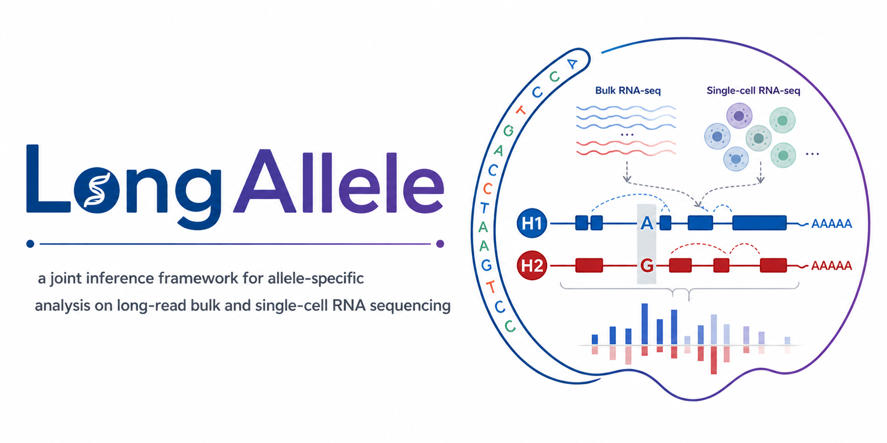
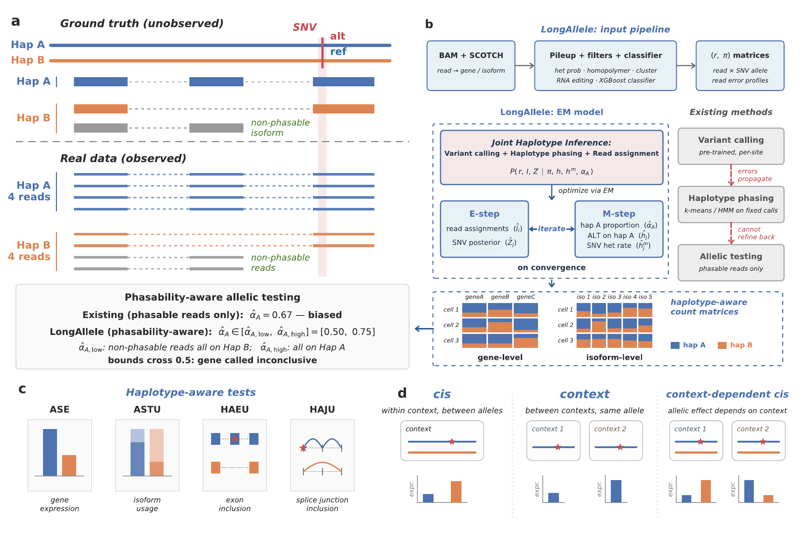

<p align="center">
  
</p>

<p align="center">
  <a href="https://www.python.org/"></a>
  <a href="LICENSE"></a>
  <a href="https://doi.org/10.64898/2026.05.05.722992"></a>
</p>

Allele-specific analysis from RNA-seq is a powerful approach to characterize *cis*-regulatory effects. However, existing methods remain limited in both haplotype inference and allelic testing. Their haplotype-inference workflows separate variant calling, haplotype phasing, and read-haplotype assignment into sequential steps, failing to fully exploit within-read single-nucleotide variant (SNV) linkage information and propagating errors into downstream allelic analysis. At the testing stage, they ignore non-phasable reads lacking heterozygous SNVs, biasing calls and inflating false positives, and remain incomplete across gene-, isoform-, and local-event-level variant effects.

Here, we present **LongAllele**, a statistical framework that employs an expectation–maximization algorithm to jointly infer heterozygous variants, haplotype structure, and read-haplotype assignments from long-read bulk and single-cell RNA sequencing. LongAllele further introduces **phasability-aware testing** that explicitly accounts for non-phasable reads, avoiding inflated false-positive calls when haplotype information is incomplete. It also enables **comprehensive allelic testing** across gene-level allele-specific expression (**ASE**), isoform-level allele-specific transcript usage (**ASTU**), and local-event-level haplotype-associated exon and junction usage (**HAEU** and **HAJU**), providing a multi-scale view of *cis*-regulation. LongAllele offers a unified framework for haplotype-resolved *cis*-regulatory analysis across diverse cellular contexts.

<p align="center">
  
</p>

## Installation

```bash
git clone https://github.com/WGLab/LongAllele.git
cd LongAllele
# Recommended: a fresh Python 3.9+ environment (conda or venv)
pip install -r requirements.txt
```

**Upstream dependency:** [SCOTCH](https://github.com/WGLab/SCOTCH) is required to produce the `scotch_target` directory consumed by LongAllele. 

## Quickstart

LongAllele runs on HPC clusters via SLURM. The bundled `longallele.sh` script submits all pipeline steps as a dependency-chained job graph — one command is all you need.

**1. Fill in your paths and basic parameter settings:**

```bash
cp config_template.sh my_run.sh
# edit my_run.sh — set SCOTCH_TARGET, BAM_PATH, REF_FASTA, OUTPUT_DIR, etc.
```

**2. Submit the full pipeline:**

```bash
bash longallele.sh my_run.sh
```

That's it. All steps are submitted with correct SLURM dependencies and run automatically in order. Output lands in `OUTPUT_DIR` once all jobs complete.

```
# Example output after submission:
Step 1   variant calling    → array job 1001  (50 tasks)
Step 1.5 read-block collect → array job 1002  (1 task, parallel with step 2)
Step 2   EM input           → array job 1003  (50 tasks)
Step 1.5 read-block merge   → job      1004
Step 3   EM haplotyping     → array job 1005  (50 tasks)
Step 4   summary + counts   → job      1006
Step 5   downstream         → job      1007

step1(1001) ──┬──→ step1_5(1002) ──→ step1_5_merge(1004) ─────┐
              └──→ step2(1003) ──→ step3(1005) ──→ step4(1006) ─┴──→ step5(1007)
```

See [Pipeline](#pipeline) for per-step documentation and all configurable arguments.

## Pipeline

LongAllele consists of five sequential steps. The pipeline takes an aligned BAM and reference FASTA (with [SCOTCH](https://github.com/WGLab/SCOTCH) read-to-isoform mappings as upstream input) and produces per-gene haplotype statistics, haplotype-aware count matrices (gene- and isoform-levels), and downstream allelic effect-size and SNV–event linkage tables. Each step below documents its task, parallelization, outputs, and (folded) configurable arguments.

All genomic positions in LongAllele outputs use **0-based** coordinates.

```
BAM + FASTA
    ↓
SCOTCH  ───────────────────────────────────────────────┐
    ↓ (read→gene/isoform mappings)                     │
Step 1: Variant calling (initial SNV candidates)       │
    ↓                                                  │
Step 2: EM input generation (per-gene read×SNV tables) │
    ↓                                                  │
Step 3: EM haplotyping (read→haplotype assignments)    │
    ↓                                                  │
Step 4: Summary statistics + count matrices            │
    ↓                                                  │
Step 5: Downstream analysis ◄──────────────────────────┘
        (effect sizes, SNV–event linkage)
```

### Step 1 — Variant calling
This step generates initial heterozygous SNV candidates from per-gene pileup of the aligned BAM.

<details open>
<summary><b>Parallelization</b></summary>

SLURM array parallelized across genes. Add `--n_jobs N --job_index $SLURM_ARRAY_TASK_ID` to fan out across array tasks.

</details>

<details>
<summary><b>Configurable arguments</b></summary>

**Required**

| Parameter | Description |
|---|---|
| `--task` | `step1` |
| `--scotch_target` | Path(s) to SCOTCH output directory (space-separated for multi-sample) |
| `--bam_path` | Aligned BAM file(s) (space-separated for multi-sample) |
| `--ref_fasta_path` | Reference genome FASTA |
| `--output_folder` | Output directory |

**Optional**

| Parameter | Description | Default |
|---|---|---|
| `--depth` | Minimum read depth at SNV position | 20 |
| `--n_alt_count` | Minimum alt-allele read count | 10 |
| `--min_mapq` | Minimum mapping quality | 20 |
| `--min_baseq` | Minimum base quality | 5 |
| `--min_dist_to_end` | Minimum distance from read end | 3 |
| `--prefix` | Output filename prefix | none |
| `--gene_subset_path` | Restrict to subset of genes (one ID per line) | none |
| `--sample_names` / `--sample_name_parse` | Multi-sample naming overrides | auto |
| `--ref_pickle_path` | Pre-built reference pickle | auto |
| `--n_jobs` / `--job_index` | Array parallelization | 1 / 0 |

</details>

<details open>
<summary><b>Job completion</b></summary>

A `step1_job{N}.done` marker is written to `{output_folder}/job_markers/` for each successful array task. After the array finishes, `ls {output_folder}/job_markers/step1_*.done | wc -l` should equal `--n_jobs`.

</details>

### Step 2 — EM input generation
This step prepares the per-gene read profile and error profile used as input by the EM in step 3.

<details open>
<summary><b>Parallelization</b></summary>

SLURM array parallelized across genes (use the same `--n_jobs N` size as step 1). Add `--n_jobs N --job_index $SLURM_ARRAY_TASK_ID`.

</details>

<details>
<summary><b>Configurable arguments</b></summary>

**Required** — same as Step 1 (`--task step2`, `--scotch_target`, `--bam_path`, `--ref_fasta_path`, `--output_folder`).

**Optional** — same set as Step 1.

</details>

<details open>
<summary><b>Job completion</b></summary>

A `step2_job{N}.done` marker is written to `{output_folder}/job_markers/` for each successful array task. After the array finishes, `ls {output_folder}/job_markers/step2_*.done | wc -l` should equal `--n_jobs`.

</details>

### Step 3 — EM haplotyping
This step jointly infers heterozygous variants, haplotype structure, and read–haplotype assignment per gene via expectation–maximization.

<details open>
<summary><b>Parallelization</b></summary>

SLURM array parallelized across genes (same `--n_jobs N` as steps 1–2). Add `--n_jobs N --job_index $SLURM_ARRAY_TASK_ID`.

</details>

<details>
<summary><b>Configurable arguments</b></summary>

**Required**

| Parameter | Description |
|---|---|
| `--task` | `step3` |
| `--scotch_target` | Path(s) to SCOTCH output directory |
| `--bam_path` | Aligned BAM file(s) |
| `--ref_fasta_path` | Reference genome FASTA |
| `--output_folder` | Output directory |

**Common optional**

| Parameter | Description | Default |
|---|---|---|
| `--prefix` | Output filename prefix | none |
| `--cell_type_df_path` | CSV with `Cell` / `CellType` columns for per-cell-type analysis | none |
| `--gene_subset_path` | Restrict to subset of genes | none |
| `--rna_editing_db` | A-to-I editing DB (`.npz`); override only for non-hg38 | bundled hg38 |
| `--snv_confidence_path` | Pre-defined high-confidence SNV set; skips noise filters | none |
| `--n_jobs` / `--job_index` | Array parallelization | 1 / 0 |
| `--mtx` / `--csv` | Per-cell count matrix output format | csv |

#### EM tuning

| Parameter | Description | Default |
|---|---|---|
| `--seed` | Random seed for EM initialization | 42 |
| `--max_iter` | Maximum EM iterations per gene | 50 |
| `--tol` | Convergence tolerance (parameter delta) | 1e-3 |
| `--heterozygous_filter` | Heterozygosity probability threshold | 0.99 |
| `--het_fallback` | Stepped het-threshold descent | off |

When `--het_fallback` is enabled, the threshold decreases by 0.05 iteratively down to 0.5; the first step yielding any passing SNVs is used, capped at `ceil(6.6 × exon_length / 1000)` per gene. Intended for simulated / low-coverage data; off by default for real high-coverage data.

#### SNV noise filtering (pre-EM)

Skipped entirely when `--snv_confidence_path` is provided.

| Filter | What it removes | Parameter | Default |
|---|---|---|---|
| Heterozygous probability | Homozygous sites (binomial model) | `--heterozygous_filter` | 0.99 |
| Low-complexity repeat | Homopolymer / dinuc / trinuc repeats | `--repeat_filter_kmer` | 1 |
| Long alt stretch | Long repeat artifacts | `--alt_stretch_filter` | 50 |
| Variant cluster | Dense SNV runs (escape: `alt_count ≥ --alt_cluster_filter` is kept) | `--var_cluster_window` / `--var_cluster_n` / `--alt_cluster_filter` | 20 bp / 3 SNVs / 150 |
| RNA editing | Known A-to-I editing sites (REDIportal v3) | `--rna_editing_db` | bundled hg38 |

`--repeat_filter_kmer` controls which repeat sizes are checked:

| Value | Behavior | Recommended for |
|---|---|---|
| `0` | Disabled | Pre-called confident SNV input |
| **`1`** (default) | Homopolymer (≥5 consecutive single base) | General use |
| `2` | + Dinucleotide repeats (≥3 copies, e.g. `ACACAC`) | Stricter filtering |
| `3` | + Trinucleotide repeats (≥3 copies, e.g. `AAGAAGAAG`) | Most aggressive |

⚠️ Trinucleotide filtering can remove genuine heterozygous variants in synonymous codon repeats with functional splicing effects.

The bundled RNA editing database is derived from [REDIportal v3](https://rediportal.cloud.ba.infn.it/) (15.7 M sites, hg38, 24 MB, 0-based, per-chromosome sorted arrays for `np.searchsorted` lookup). Override `--rna_editing_db` only for non-hg38 references.

#### Advanced — SNV classifier (optional)

Pre-EM classifier-based filtering. Train a classifier on validated SNV calls and apply scores to filter or initialize haplotype priors.

| Parameter | Description | Default |
|---|---|---|
| `--snv_classifier` | Path to serialized classifier (`.joblib`) | none |
| `--clf_hard_threshold` | Drop SNVs below this classifier score | 0.05 |
| `--clf_init` | Use classifier scores to initialize `h_m` in EM. **Strongly recommended to set for real data.** | off |
| `--gap_tau` | Gap threshold for `adaptive_keep_mask` (1.0 = disabled) | 1.0 |
| `--clf_pruning_threshold` | Score below which SNVs are considered low-quality | 0.1 |
| `--clf_pruning_frac` | Max fraction of low-quality SNVs allowed (1.0 = no pruning) | 1.0 |

#### Advanced — High-artifact mode (snRNA-seq nascent-RNA leak)

Single-nucleus RNA-seq libraries can contain substantial unspliced pre-mRNA (nascent-RNA leak). In long-read snRNA-seq, intron-dominated reads have ambiguous isoform origin and introduce artifacts into haplotype phasing. High-artifact mode (`--high_artifact_mode`) is an opt-in opt that adds two disabled-by-default filters to mitigate this. Default OFF; output is byte-identical to the standard pipeline when disabled.

- **SNV-level filter.** LongAllele uses both exonic and intronic SNVs as phasing markers by default. In high-artifact mode, SNVs in read-dense intronic regions of high-leak genes are excluded (controlled by `--novel_exon_pct_max`), preventing nascent intronic allelic biases from distorting read–haplotype assignment for mature transcripts.
- **Read-level filter.** Reads whose alignments lie predominantly within introns are also excluded (controlled by `--read_intronic_pct_max`).

| Parameter | Description | Default |
|---|---|---|
| `--high_artifact_mode` | Enable the SNV-level + read-level filters above | off |
| `--novel_exon_pct_max` | SNV-level filter cutoff: per-gene fraction of intronic territory broadly covered by reads; genes above the cutoff drop intronic SNVs | 0.25 |
| `--read_intronic_pct_max` | Read-level filter cutoff: per-read intronic / total aligned bp; reads above the cutoff are excluded | 0.60 |
| `--gsi_base_pkl_path` | Explicit path to SCOTCH base pickle (auto-resolved if omitted) | auto |

</details>

<details open>
<summary><b>Job completion</b></summary>

A `step3_job{N}.done` marker is written to `{output_folder}/job_markers/` for each successful array task. After the array finishes, `ls {output_folder}/job_markers/step3_*.done | wc -l` should equal `--n_jobs`.

</details>

### Step 4 — Summary statistics + count matrix
This step aggregates per-gene haplotype statistics and produces haplotype-aware count matrices at both gene and isoform levels (bulk + per cell type).

<details open>
<summary><b>Parallelization</b></summary>

Single job by default, or SLURM array across samples for multi-sample inputs (`--job_array_by_sample --job_index $SLURM_ARRAY_TASK_ID`).

</details>

<details open>
<summary><b>Outputs</b></summary>

| File | Path |
|---|---|
| `summary_statistics.csv` | `{output_folder}/summary_statistics_{prefix}/summary_statistics.csv` |
| `snv_hap_map.csv` | `{output_folder}/snv_hap_{prefix}/snv_hap_map.csv` |
| `read_hap_map.csv` | `{output_folder}/snv_hap_{prefix}/read_hap_map.csv` |
| Per-gene summaries | `{output_folder}/summary_statistics_{prefix}/all_genes_separate/` |
| Bulk isoform count matrices | `{output_folder}/count_hap_{prefix}/all_genes/` |
| Per-cell-type isoform tables | `{output_folder}/count_hap_{prefix}/ct_isoform_separate/{cell_type}/` |
| Per-cell-type aggregated isoform tables | `{output_folder}/count_hap_{prefix}/all_genes/ct_{cell_type}_isoform_agg*.csv` |

</details>

<details>
<summary><b>Column dictionary</b></summary>

**`summary_statistics.csv` — per-gene haplotype + isoform statistics**

| Column | Description |
|---|---|
| `geneID`, `geneName` | Gene identifiers |
| `gamma` | EM mapping-bias parameter (fixed at 0.5 in current model) |
| `n_reads`, `n_reads_phasable`, `n_snvs` | Per-gene read and SNV counts (`n_reads_phasable` = reads that cover ≥1 phasing SNV) |
| `alpha_hat`, `alpha_hat_low`, `alpha_hat_high` | Minor haplotype allelic balance (EM point estimate + bounds) |
| `major_hap` | Major haplotype label (`A` or `B`) |
| `ll_alt`, `ll_null` | Log-likelihoods of the alternative (αEM) and null (α = 0.5) models |
| `lrt_stat`, `p_value` | Likelihood ratio statistic and unadjusted gene-level ASE p-value |
| `p_value_gene_adj` | FDR-adjusted gene-level ASE p-value (within sample) |
| `chi2_isoform`, `df_isoform` | Chi-squared statistic and degrees of freedom for the ASTU test |
| `p_value_isoform`, `p_value_isoform_high`, `p_value_isoform_low` | ASTU p-values (point + bound variants) |
| `p_value_isoform_adj`, `p_value_isoform_adj_high`, `p_value_isoform_adj_low` | FDR-adjusted ASTU p-values |
| `CellType` | Cell type identifier (`Bulk` for bulk-level rows) |

**`snv_hap_map.csv` — per-SNV haplotype assignments**

| Column | Description |
|---|---|
| `chrom`, `pos` | SNV genomic coordinates (0-based) |
| `ref`, `alt` | Reference and alternate alleles |
| `depth`, `alt_count`, `alt_frac` | Read support at the SNV site |
| `ID` | SNV identifier (`chr:pos:ref:alt`) |
| `het_prob` | Heterozygous probability under the binomial model |
| `h_A` | Probability that the alt allele is on haplotype A |
| `h_m` | Marker probability — confidence that the SNV is a true heterozygous phasing marker |
| `hat_Z_binary` | Binary indicator (1 = SNV retained as a phasing marker after EM) |
| `geneName`, `geneID` | Gene identifiers |

**`read_hap_map.csv` — per-read haplotype posteriors**

| Column | Description |
|---|---|
| `Read` | Read name from the source BAM |
| `hat_I` | Posterior probability that the read is on haplotype A |
| `hat_I_B` | Posterior probability that the read is on haplotype B (= 1 − `hat_I`) |
| `geneName`, `geneID` | Gene identifiers |

</details>

<details>
<summary><b>Configurable arguments</b></summary>

**Required**

| Parameter | Description |
|---|---|
| `--task` | `step4` |
| `--scotch_target` | Path(s) to SCOTCH output directory |
| `--output_folder` | Output directory |
| `--summary_haplotype` | Write `summary_statistics.csv` (required for step 5 input) |
| `--summary_count` | Write count matrices (bulk + per-cell-type) |

Both `--summary_haplotype` and `--summary_count` are flags that default to off — without them, step 4 runs but produces no output.

**Optional**

| Parameter | Description | Default |
|---|---|---|
| `--prefix` | Output filename prefix | none |
| `--cell_type_df_path` | CSV with `Cell` / `CellType` columns | none |
| `--job_array_by_sample` | Process one sample per `job_index` (multi-sample) | off |
| `--job_index` | Sample index when `--job_array_by_sample` is on | 0 |

</details>

<details open>
<summary><b>Job completion</b></summary>

`{output_folder}/job_markers/step4.done` is written when step 4 finishes (or `step4_sample{i}.done` per sample when `--job_array_by_sample` is on).

</details>

### Step 5 — Downstream analysis
This step computes per-SNV and per-event allelic effect sizes (ASE, ASTU) and haplotype–event association tests, and links nearby SNVs to their events.

<details open>
<summary><b>Parallelization</b></summary>

Single job, multi-CPU by default (set `--n_workers` to your available CPU count). For multi-sample inputs, run as a SLURM array across samples (`--job_array_by_sample --job_index $SLURM_ARRAY_TASK_ID`).

</details>

<details open>
<summary><b>Outputs</b></summary>

| File | Description | Path |
|---|---|---|
| `gene_snv.csv` | SNV-centric — phased SNV assignments and signed ASE / ASTU effects, with gene-level allelic statistics per cell type. | `{output_folder}/downstream_{prefix}/gene_snv.csv` |
| `event_snv.csv` | Event-centric — haplotype-associated exon and junction events, linked nearby SNVs, and raw chi-squared validation. | `{output_folder}/downstream_{prefix}/event_snv.csv` |

</details>

<details>
<summary><b>Column dictionary</b></summary>

**`gene_snv.csv` — SNV-centric table**

| Column | Description |
|---|---|
| `Sample`, `CellType` | Sample and cell type identifiers |
| `geneID`, `geneName`, `geneChr` | Gene identifiers |
| `n_reads`, `n_reads_phasable`, `gene_n_snvs`, `gene_n_snvs_called` | Gene-level read counts (`n_reads`, `n_reads_phasable`) and SNV counts — `gene_n_snvs` = total candidate SNVs, `gene_n_snvs_called` = SNVs actually called / used in phasing. |
| `gene_alpha_hat`, `gene_alpha_hat_low`, `gene_alpha_hat_high` | Minor haplotype allelic balance (EM estimate + bounds) |
| `gene_alpha_hat_major`, `gene_alpha_hat_major_low`, `gene_alpha_hat_major_high` | Major haplotype allelic balance (1 − minor) |
| `gene_major_hap`, `gene_minor_hap` | Haplotype labels (A or B) |
| `gene_p_value`, `gene_p_value_adj` | Gene-level ASE significance test on phased reads (BH-adjusted). **Raw test significance, NOT the final call** — small p alone over-calls ASE; final call is `ASE_call`. |
| `ASE_call` | **Final ASE call** (3-category): `1` significant (`gene_p_value_adj ≤ 0.05` **and** `gene_alpha_hat_high < 0.5`), `-1` not significant (`gene_p_value_adj > 0.05`), `0` inconclusive (p significant but α CI overlaps 0.5). |
| `dominant_isoform_overall` | Most expressed isoform across both haplotypes |
| `top_isoform_hap_major`, `top_isoform_hap_minor` | Top isoform on each haplotype |
| `top_isoform_hap_major_frac`, `top_isoform_hap_minor_frac` | Fraction of hap reads from top isoform |
| `isoform_p_value`, `isoform_p_value_adj` | Gene-level ASTU significance test on phased reads (point estimate, BH-adjusted). **Raw test significance, NOT the final call** — final call is `ASTU_call`. |
| `isoform_p_value_high`, `isoform_p_value_low`, `isoform_p_value_adj_high`, `isoform_p_value_adj_low` | ASTU significance at the high / low bounds of the isoform-balance CI (BH-adjusted); used to derive `ASTU_call`. |
| `ASTU_call` | **Final ASTU call** (3-category): `1` significant (`isoform_p_value_adj_high ≤ 0.05`), `-1` not significant (`isoform_p_value_adj_low > 0.05`), `0` inconclusive (low bound significant but high bound not). |
| `shrinkage_k` | Shrinkage constant added to major / minor hap read counts when computing `es_ase` / `es_astu` (effect-size regularization; does **not** shape the CI). |
| `es_ase` | ASE effect size: log2(major / minor hap reads) |
| `es_astu` | ASTU effect size: log2(dominant isoform major / minor fraction) |
| `astu_source` | `bulk`, `ct_specific`, or `bulk_fallback` |
| `snvID` | Stable SNV key (`chr:pos:ref:alt`) |
| `snv_pos`, `snv_ref`, `snv_alt` | SNV coordinates and alleles |
| `snv_depth_bulk`, `snv_alt_count_bulk`, `snv_alt_frac_bulk` | SNV read support from variant calling (bulk pileup) |
| `h_A`, `hat_Z_prob_revised` | Haplotype-A frequency and phasing confidence |
| `snv_hap` | Haplotype carrying the alt allele (A or B) |
| `snv_on_minor_hap` | Whether SNV alt allele is on the minor haplotype |
| `snv_expr_direction` | `higher_gene_expression` or `lower_gene_expression` |
| `snv_es_ase_signed` | Signed ASE effect from SNV alt allele perspective |
| `dominant_isoform_pref_hap` | Haplotype with higher dominant isoform usage |
| `snv_astu_direction` | `+` if dominant isoform increased on SNV hap, `−` otherwise |
| `snv_es_astu_signed` | Signed ASTU effect from SNV alt allele perspective |

**`event_snv.csv` — Event-centric table**

| Column | Description |
|---|---|
| `Sample`, `CellType` | Sample and cell type identifiers |
| `geneID`, `geneName`, `geneChr` | Gene identifiers |
| `gene_major_hap`, `es_ase`, `es_astu` | Gene context (duplicated for self-containment) |
| `ASE_call`, `ASTU_call` | Final ASE / ASTU calls (3-category) for the gene, duplicated from `gene_snv.csv` — see that table for the rules. |
| `dominant_isoform_overall`, `top_isoform_hap_major`, `top_isoform_hap_minor` | Isoform context |
| `eventID` | Stable event key (`event_type:start-end`) |
| `event_type` | `exon` or `junction` |
| `event_start`, `event_end` | Event genomic coordinates |
| `w_A_present`, `w_A_absent`, `w_B_present`, `w_B_absent` | Weighted haplotype read counts |
| `obs_hapA_include`, `obs_hapA_skip`, `obs_hapA_unobserved` | Haplotype-A weighted read counts from raw BAM CIGAR observation: read alignment includes the event, splices over it (cassette skip / different junction), or fails to cover the event region (truncated). |
| `obs_hapB_include`, `obs_hapB_skip`, `obs_hapB_unobserved` | Same three categories for haplotype-B. The three columns sum to the per-read EM weight total in the joined pool (`obs_*` is per-read; existing `w_*` is isoform-multiplicity weighted, so the two are not equal when reads map to multiple isoforms). |
| `obs_chi2`, `obs_p_value`, `obs_p_value_adj` | Chi-square test on the 2×2 `[[hapA_include, hapA_skip], [hapB_include, hapB_skip]]` table — `unobserved` is dropped so truncated reads don't pollute the test. Runs whenever both row and column margins are non-zero (a single zero cell is kept — complete include/skip on one hap is the strongest allele-specific signal); only an all-zero row/column → `insufficient_data`. `obs_p_value_adj` = within-gene BH FDR across events where `obs_test_type == 'chi2_hap_event'`; NaN `obs_p_value` → NaN adj. |
| `obs_test_type` | `chi2_hap_event` (test ran), `insufficient_data` (2×2 sum < min_reads or a whole row/column margin is 0), or `no_bam` (per-gene `read_blocks.pkl` not present; other obs_* are `None`). Run `--task step1_5` (per-sample SLURM array, one task per BAM) followed by `--task step1_5_merge` (single task) to populate the pkl cache. |
| `event_inclusion_frac_A`, `event_inclusion_frac_B` | Inclusion fraction per haplotype |
| `event_pref_hap` | Haplotype with higher event inclusion |
| `event_pref_major_minor` | `major` or `minor` relative to gene expression |
| `event_chi2`, `event_p_value`, `event_p_value_adj` | Haplotype-event association test (within-gene FDR), SCOTCH isoform-inferred membership. Compare against `obs_*` for sensitivity to read truncation. |
| `has_linked_snv` | Whether a nearby confident SNV is linked |
| `linked_snv_count` | Number of nearby SNVs linked to this event |
| `is_nearest_snv_for_event` | Whether this is the closest linked SNV |
| `snvID`, `snv_pos`, `snv_ref`, `snv_alt` | Linked SNV identity (`NaN` if none) |
| `snv_hap`, `h_A`, `hat_Z_prob_revised` | SNV phasing info (`NaN` if none) |
| `exonic_distance`, `genomic_distance` | Distance from SNV to event boundary |
| `snv_expr_direction`, `snv_astu_direction` | SNV regulatory interpretation |
| `snv_event_direction` | `promotes_event` or `reduces_event` |
| `raw_validation_available` | Whether raw read validation was performed |
| `raw_ref_present`, `raw_ref_absent`, `raw_alt_present`, `raw_alt_absent` | Raw BAM allele × event counts |
| `raw_total_reads` | Total raw reads in contingency table |
| `raw_chi2`, `raw_p_value`, `raw_p_value_adj` | Raw-read validation statistics. `raw_chi2` is populated only for `chi2_cross_event`; for `binomial_intra_event`, `raw_p_value` is the binomial test result and `raw_chi2` is `None`. `raw_p_value_adj` = within-gene BH FDR across all `(event, SNV)` raw tests; NaN `raw_p_value` → NaN adj. |
| `raw_test_type` | `chi2_cross_event` (default 2×2 chi-square) or `binomial_intra_event` (SNV inside the exon event — fallback binomial test on ref vs alt counts, p=0.5). |

Canonical reference (with interpretation of the two event tests): [`docs/output_schema.md`](docs/output_schema.md).

</details>

<details>
<summary><b>Configurable arguments</b></summary>

**Required**

| Parameter | Description |
|---|---|
| `--task` | `step5` |
| `--scotch_target` | Path(s) to SCOTCH output directory |
| `--bam_path` | Aligned BAM file(s) (used for raw SNV–event chi-squared) |
| `--output_folder` | Output directory |

**Common optional**

| Parameter | Description | Default |
|---|---|---|
| `--prefix` | Output filename prefix | none |
| `--cell_type_df_path` | CSV with `Cell` / `CellType` columns | none |
| `--gene_subset_path` | Restrict to subset of genes | none |
| `--n_workers` | Parallel worker processes | 1 |
| `--job_array_by_sample` / `--job_index` | Sample-array execution | off / 0 |

**Downstream knobs**

| Parameter | Description | Default |
|---|---|---|
| `--event_min_reads` | Minimum weighted read count per event test | 10 |
| `--snv_event_distance` | ±bp exonic distance for SNV–event linking | 50 |
| `--event_mode` | `all_events` / `switching_events` / `fdr_events` | `all_events` |
| `--fdr_events_value` | FDR cutoff when `event_mode=fdr_events` | 0.05 |
| `--astu_sig_only` | Filter Task 4 to ASTU-significant genes (per cell type) | off |
| `--astu_sig_from_bulk` | Use Bulk ASTU significance for all cell types (overrides `--astu_sig_only`) | off |
| `--astu_sig_threshold` | p-value cutoff for ASTU gene filtering | 0.05 |

</details>

<details open>
<summary><b>Job completion</b></summary>

`{output_folder}/job_markers/step5.done` is written when step 5 finishes. To audit per-step missing genes across the whole pipeline, run `--task check`:

```bash
python src/longallele.py --task check \
    --scotch_target /path/to/scotch_output \
    --output_folder /path/to/results \
    --n_jobs 50
```

</details>

### Note: `obs_*` validation columns

`longallele.sh` automatically handles read-block collection (`--task step1_5` / `step1_5_merge`) as part of the submitted job graph — no extra action needed. These tasks run in parallel with step 2 and their output is ready before step 5 starts.

If running steps manually (without `longallele.sh`), see the [step 1.5 tasks](#configurable-arguments-3) in the Pipeline section for the two-part collection commands.

## Citation

If you use LongAllele, please cite our preprint:

> Xu Z, Wang K. LongAllele: a joint inference framework for allele-specific analysis on long-read bulk and single-cell RNA sequencing. *bioRxiv* 2026. https://doi.org/10.64898/2026.05.05.722992

```bibtex
@article{longallele2026,
  title   = {LongAllele: a joint inference framework for allele-specific
             analysis on long-read bulk and single-cell RNA sequencing},
  author  = {Xu, Zhuoran and Wang, Kai},
  journal = {bioRxiv},
  year    = {2026},
  doi     = {10.64898/2026.05.05.722992},
  url     = {https://www.biorxiv.org/content/10.64898/2026.05.05.722992}
}
```

## Contributing and support

Bug reports, feature requests, and questions are welcome via [GitHub Issues](https://github.com/WGLab/LongAllele/issues). Pull requests are also welcome — please open an issue first to discuss substantial changes.

## License

LongAllele is released under the [MIT License](LICENSE).
