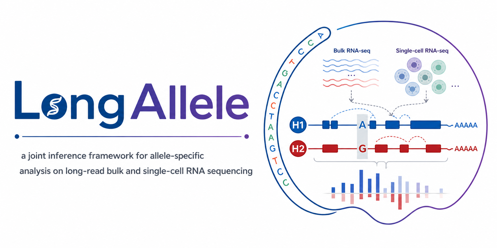

<p align="center">
  
</p>

<p align="center">
  <a href="https://www.python.org/"></a>
  <a href="LICENSE"></a>
  <a href="https://www.biorxiv.org/content/10.64898/2026.05.05.722992v2"></a>
</p>

## Getting Started

We recommend a fresh Python 3.9+ environment (conda or venv).

```sh
# download and install
git clone https://github.com/WGLab/LongAllele.git
cd LongAllele
pip install -r requirements.txt

# run the pipeline from one config file
cp config_template.sh my_run.sh     # edit paths and settings (see Configuration)
bash longallele.sh my_run.sh
```

## Table of Contents

- [Introduction](#introduction)
- [Configuration](#configuration)
- [Demo](#demo)
- [Citation](#citation)
- [Contributing and support](#contributing-and-support)
- [License](#license)

## Introduction

**LongAllele** is software for allele-specific analysis of long-read bulk, single-cell and single-nucleus RNA-seq data. It supports Oxford Nanopore (cDNA and direct RNA), PacBio (HiFi Iso-Seq and MAS-Seq), and other long-read RNA-seq platforms. Platform-specific SNV classifiers are provided for the four listed platforms, with a classifier-free mode for other platforms.

<details>
<summary><b>1. Light mode</b></summary>

Supports joint SNV calling, gene-level haplotype phasing, read-to-haplotype assignment and allele-specific expression (ASE).

- **Input:**
  - Genome-aligned BAM
  - Reference FASTA
  - Reference annotation GTF
- **Output:**
  - SNV calls
  - Gene-level haplotypes
  - Per-read haplotype probabilities
  - Haplotype-resolved gene counts
  - ASE results

</details>

<details>
<summary><b>2. Regular mode</b></summary>

Additionally supports allele-specific transcript usage (ASTU), haplotype-associated exon/junction usage (HAEU/HAJU), and comparisons of allelic effects across cell types or tissues.

- **Input:**
  - Genome-aligned BAM
  - Reference FASTA
  - Upstream read-to-gene/isoform assignments with corresponding transcript structures, supplied by SCOTCH or other tools through the documented input interface. An IsoQuant adapter is included.
- **Output:**
  - All light-mode outputs
  - Haplotype-resolved isoform counts
  - ASTU and exon/junction test results
  - Cross-cell-type or cross-tissue comparisons

</details>

<details>
<summary><b>3. Single-cell and single-nucleus data</b></summary>

Reads are pooled across cells for SNV calling, phasing and read-to-haplotype assignment, followed by cell-type-specific allelic analyses.

- **Additional input:**
  - Read-to-cell mappings
  - Cell-to-cell-type annotations (for cell-type-specific analyses)
  - Barcode processing and any required UMI deduplication are completed upstream
- **Additional output:**
  - Per-cell haplotype-resolved count matrices
  - ASE, ASTU and exon/junction results per cell type
  - Allelic context variability (ACTV): permutation tests across cell types

</details>

Code to reproduce the analyses and figures in the manuscript is available at [WGLab/LongAllele_Analysis](https://github.com/WGLab/LongAllele_Analysis/tree/main).

## Configuration

Set your input paths and run settings in your copy of [config_template.sh](config_template.sh):

| Setting | Value |
|---|---|
| `BAM_PATH` | Genome-aligned, indexed BAM |
| `REF_FASTA` | Reference genome FASTA |
| `OUTPUT_DIR` | Results directory |
| `PLATFORM` | `ont-cdna`, `ont-drna`, `hifi-isoseq`, `hifi-masseq`, or `other` |
| `RUNNER` | `local` or `slurm`; for SLURM, also set `PARTITION` |

Choose an input mode and add its required settings to those above:

| Input mode | Setting | Additional required settings |
|---|---|---|
| Regular: [SCOTCH](docs/upstream_input_contract.md#scotch) | `INPUT=scotch` | `SCOTCH_TARGET`: SCOTCH output directory containing read-to-isoform assignments and transcript annotations |
| Regular: [IsoQuant](docs/upstream_input_contract.md#isoquant) | `INPUT=isoquant` | `ISOQUANT_DIR`: IsoQuant output directory; `GTF`: reference gene annotation GTF used by IsoQuant; `BULK`: `true` for bulk, `false` for single-cell/nucleus |
| Regular: [Other tools](docs/upstream_input_contract.md#other-upstream-tools) | `INPUT=scotch` | `SCOTCH_TARGET`: converted output directory in the supported input format |
| [Light](docs/upstream_input_contract.md#light-mode) | `INPUT=light` | `GTF`: reference gene annotation GTF matching your reference genome; `BULK`: `true` for bulk, `false` for single-cell/nucleus |

See [input preparation](docs/upstream_input_contract.md) for preparing your data, the [configuration guide](docs/pipeline_steps.md) for all settings, and [output files and columns](docs/output_schema.md) for interpreting results.

## Demo

Run the bundled 10-gene PBMC ONT example from the repository root:

```bash
cd examples/pbmc_demo
bash run_demo.sh
```

The demo writes `demo_output/`. See the [demo documentation](examples/pbmc_demo) for inputs and [expected results](examples/pbmc_demo/expected_output).

## Citation

If you use LongAllele, please cite our preprint:

> Xu Z, Wang K. LongAllele: a joint inference framework for allele-specific analysis on long-read bulk and single-cell RNA sequencing. *bioRxiv* 2026. https://doi.org/10.64898/2026.05.05.722992

```bibtex
@article{longallele2026,
  title   = {LongAllele: a joint inference framework for allele-specific
             analysis on long-read bulk and single-cell RNA sequencing},
  author  = {Xu, Zhuoran and Wang, Kai},
  journal = {bioRxiv},
  year    = {2026},
  doi     = {10.64898/2026.05.05.722992},
  url     = {https://www.biorxiv.org/content/10.64898/2026.05.05.722992}
}
```

## Contributing and support

Bug reports, feature requests, and questions are welcome via [GitHub Issues](https://github.com/WGLab/LongAllele/issues). Pull requests are also welcome — please open an issue first to discuss substantial changes.

## License

LongAllele is released under the [MIT License](LICENSE).
